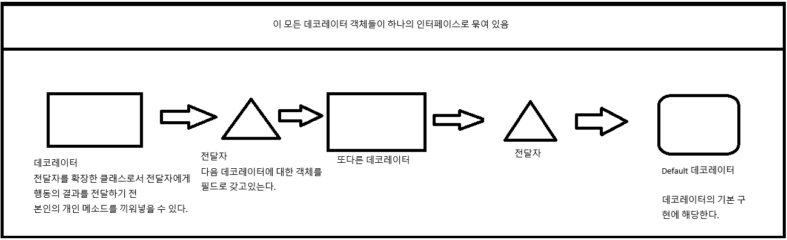

## 상속보다는 컴포지션을 활용하라.

상속을 하면 캡슐화가 깨진다는 얘기가 있다.

우선 캡슐화를 생각해보면, 기본적으로 데이터의 캡슐화를 의미한다면 데이터와 그에 상응하는 메소드를 묶어놓는것을 말하기도 하고

추가적으로 자율적인 객체가 책임을 수행하는데 있어서 외부의 객체와 메세지를 주고받을 용도로 공개하는것과, 본인이 해당 책임수행에 있어 자율적으로 선택하는 방법(메소드)들로 구성되어 있는데

이 메소드들은 외부로 공개될 필요가 없다. 즉, 외부의 객체는 해당 메세지의 응답을 받는데 있어서 해당 객체가 무슨 방법으로 응답을 만드는진 관심 없고, 알 필요도 없다.

그런데 상속을 하고, 상위 클래스의 메소드를 오버라이딩하고, 해당 오버라이딩된 메소드가 super를 통해 부모메소드를 호출하는 경우가 문제가 된다.

왜냐하면 부모 메소드가 변경되었을 때 영향을 강하게 받을수도 있기 때문이다. 즉, 하위 클래스를 설계하는 사람이 부모 클래스의 메소드 구현부에 관심을 기울여야한다.

결론부터 말하자면 상속은 진짜 두 클래스가 `is-a`관계일 때만 상속을 해야한다.

대다수의 경우에서는 `합성`을 사용해야 하는 경우가 대부분이다.


```java
public class InstrumentedHashSet<E> extends HashSet<E> {

    private int addCount = 0;

    public InstrumentedHashSet() {

    }

    public InstrumentedHashSet(int initCap, float loadFactor) {
        super(initCap, loadFactor);
    }

    @Override
    public boolean add(E e) {
        addCount++;
        return super.add(e);
    }

    @Override
    public boolean addAll(Collection<? extends E> c) {
        addCount += c.size();
        return super.addAll(c);
    }

    public int getAddCount() {
        return addCount;
    }


    public static void main(String[] args) {
        InstrumentedHashSet<String> s = new InstrumentedHashSet<>();
        s.addAll(List.of("틱", "탁탁", "펑"));
        /*
        * s.addAll()을 호출 한 순간 오버라이드 된 addAll이 호출된다. 왜냐하면 인스턴스가 상속된 InstrumentedHashSet 이기 때문
        * 여기서 addCount가 인자로 넘어온 컬렉션 크기만큼 더해지고
        * 이 이후 부모 메서드의 addAll()을 호출하는데, 여기서 부모 메소드의 addAll()은 내부적으로 add를 호출하고,
        * add는 또다시 오버라이딩된 add를 호출하기에 매순간 addCount가 더해진다.
        * 그래서 처음에 size() (즉, 3) 만큼 더해지고 3개의 원소가 add()를 호출 (+ 1)하여 6이 된다.
        * 그렇다고 addAll 메소드를 재정의 하지않으면 정상작동 하는거 아니냐? 라고 할 수 있는데
        * 이는 결국 부모 메소드에 완전히 맡기는 셈이고, 부모메소드의 동작방식이 새로운 버전으로 릴리즈 되어 동작이 바뀌는 순간 다시 또 고려해야한다.
        * */
        System.out.println(s.getAddCount());
    }
}
```

추가적으로 상위 클래스에 새로운 메소드가 추가되는 경우에도 캡슐화가 깨질 수 있다.

예를들어 내가 제공하려는 서비스에서 `String`만을 제공하는 어떤 자료구조를 상속으로 구현하려 했다고 가정하자.

여기서 상속으로 구현하기에, 모든 원소추가 메소드를 재정의하여 `String`인지 아닌지 검사하는 하위클래스의 추가메소드를 적절히 끼워넣었다.

하지만 부모 클래스에 새로운 원소추가 메소드가 생긴다면? 하위클래스도 똑같이 영향받을수 밖에 없다.

**이러한 문제들은 합성을 사용하면 자연스럽게 회피가능하다.**

먼저 합성은 기본적으로 새로운 클래스에 private 필드로 기존의 클래스 인스턴스를 참조하게 하면 된다.

더이상 재정의 하고싶을때 오버라이딩에 있어서 찾아오는 문제점들을 고려하지 않아도 된다.

아래와 같은 합성관계에서 `InstrumentedSet`을 `래퍼 클래스`라고 한다.

```java
public class InstrumentedSet<E> {

    private final Set<E> set;

    private int addCount;

    public InstrumentedSet(Set<E> set) {
        this.set = set;
    }

    public InstrumentedSet(int initCap, float loadFactor) {
        set = new HashSet<>(initCap, loadFactor);
    }

    public boolean add(E e) {
        addCount++;
        return set.add(e);
    }

    public boolean addAll(Collection<? extends E> c) {
        addCount += c.size();
        return set.addAll(c);
        // 더 이상 합성관계의 놓여있기에 set.addAll()을 하더라도, 부모의 add만을 호출하게 된다.
    }

    public int getAddCount() {
        return addCount;
    }

    public static void main(String[] args) {
        InstrumentedSet<Integer> set = new InstrumentedSet<>(new HashSet<>());
        set.addAll(List.of(1,2,3,4,5));
        System.out.println(set.getAddCount());
    }
}
```

위의 `합성관계`와 `전달`을 함께 조합하여 많은 기능들을 조합할 수 있게 도와주는 디자인 패턴을 `데코레이터 패턴`이라고 한다.

전달은 어떤 두 클래스사이의 메소드의 결과를 전달하는것이 된다.

<a href="https://refactoring.guru/ko/design-patterns/decorator">데코레이터 패턴</a>

간단하게만 알아보자면 `데코레이터 패턴`은 기본적으로 하나의 인터페이스내에 여러 구체 클래스들이 있는데, 그 구체 클래스들끼리 `조합된 클래스`도 제공하고 싶을때 사용한다.

예를들어 인터페이스 I를 구현한 구체클래스 A, B, C가 있을때

클라이언트는 원하는데로 A, B를 조합해서 쓰고싶을 수 있고, B, C를 조합해서 쓰고싶을 수 있다.

이러한 상황에서 조합된 두 클래스의 기능을 모두 가지는 AB클래스라는 새로운 클래스를 정의하여 오버라이딩 할 수 있지만

데코레이터 패턴을 사용하여 합성관계로 구현된 전달자를 사용하면, 손쉽게 여러 클래스를 연결할 수 있다.

데코레이터 패턴의 구성요소는 인터페이스, Default 데코레이터, 전달자, 데코레이터로 구성된다.

그림을 그리자면 이런 형태로 그려질 수 있다.



이러한 형태로 전달자 `FowardSet<E>`과 함께 구현하면 다음과 같다.

```java
import java.util.Collection;
import java.util.Iterator;
import java.util.Set;

public class FowardingSet<E> implements Set<E> {

    private final Set<E> s;
    // 핵심은 이곳

    public FowardingSet(Set<E> s) {
        this.s = s;
    }

    // 갖가지 메소드 위임
}
```
이제 해당 전달자를 구현하는 클래스들은 모두 데코레이터가 되고

기본 데코레이터로서 `HashSet<E>`등을 사용하면 된다.

```java
public static void main(String[] args) {
    InstrumentedSet<String> s = new InstrumentedSet<>(new HashSet<>());
    s.addAll(List.of("틱", "탁탁", "펑"));
    System.out.println(s.getAddCount());
}
```

이러한 형태로 래퍼클래스를 만들어서 활용하는것에는 단 한가지 단점이 있는데,

콜백 프레임워크와 맞지않다는 점이다.

콜백 프레임워크는 기본적으로 자기자신의 참조를 다른 객체에 넘겨서 콜백을 호출할 때 사용하도록 구성한다.

여기서 어떤 콜백을 구현하고 있는 구체 클래스를 확장한 Wrapper를 만들었다 가정하자.

구체 클래스는 콜백 프레임워크를 구현하기 위해서 자기자신 this를 넘기는데, 이 구체는 사실상 자신의 Wrapper가 있는지 없는지 모른다.

그래서 Wrapper에 콜백용 메소드를 재정의 하더라도 내부 구체 클래스의 this가 넘어가기 때문에 재정의가 의미가 없어진다.

<a href="../src/item18/callback/Practice.java">CallBack과 Composition은 안어울린다</a>